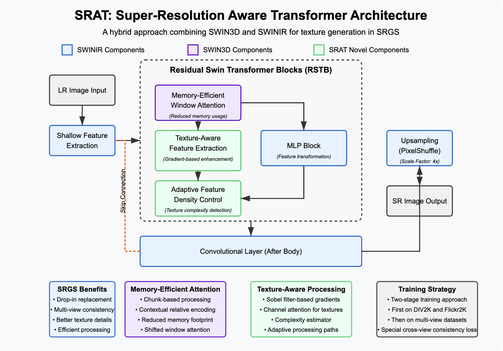

# SRAT: Super-Resolution Aware Transformer


A hybrid architecture combining SWIN3D and SWINIR for enhanced texture generation in Super-Resolution 3D Gaussian Splatting (SRGS).

## Overview

SRAT is designed as an improved super-resolution model specifically for the SRGS pipeline. By combining the architectural strengths of SWINIR and SWIN3D with novel texture-aware components, SRAT delivers:

- Higher fidelity texture details in super-resolved images
- Better cross-view consistency for multi-view synthesis
- Memory-efficient attention mechanism for reduced VRAM usage
- Adaptive feature density control based on texture complexity

This results in more detailed and accurate high-resolution renderings for novel view synthesis with 3D Gaussian Splatting.

## Key Features

- **Memory-Efficient Window Attention**: Reduces VRAM usage while maintaining transformer attention capabilities
- **Texture-Aware Feature Extraction**: Enhanced gradient-based detail preservation
- **Adaptive Feature Density Control**: Dynamically adjusts feature complexity based on texture analysis
- **Cross-View Consistency**: Specialized training for multi-view consistency
- **SRGS Integration**: Direct replacement for SWINIR in the SRGS pipeline

## Architecture



SRAT combines three key component types:
- **SWINIR Components** (blue): Core super-resolution transformer pipeline
- **SWIN3D Components** (purple): Memory-efficient attention mechanisms
- **Novel Components** (green): Texture-aware processing and adaptive control

### Key Components:

1. **Memory-Efficient Window Attention**
   - Chunk-based processing to reduce memory footprint
   - Contextual relative position encoding
   - Shifted window attention for cross-window information flow

2. **Texture-Aware Feature Extraction**
   - Sobel filter-based gradient detection
   - Channel attention for texture enhancement
   - Multi-scale texture pattern recognition

3. **Adaptive Feature Density Control**
   - Texture complexity estimator
   - Dynamic feature processing paths
   - Enhanced high-frequency detail preservation

## Installation

```bash
# Clone the repository
git clone https://github.com/omar404ahmed/dts-gs.git
cd SRAT

# Install dependencies
pip install -r requirements.txt
```

### Requirements
- Python 3.8+
- PyTorch 2.2+
- timm
- Pillow
- numpy
- pandas
- tqdm

## Usage

### Integration with SRGS

SRAT can directly replace SWINIR in the SRGS pipeline. To integrate:

1. Ensure SRAT files are in the correct locations:
```
models/
  ├── srat/
  │   ├── model_srat.py
  │   ├── __init__.py
  │   └── srat_utils.py
  └── network_swinir.py (existing file)
integration/
  └── srgs_integration.py
```

2. Modify SRGS's `train.py` to use SRAT instead of SWINIR:

```python
# Original SWINIR code (to be replaced)
"""
SR_model = net(upscale=4, in_chans=3, img_size=64, window_size=8,
            img_range=1., depths=[6, 6, 6, 6], embed_dim=180, num_heads=[6, 6, 6, 6],
            mlp_ratio=2, upsampler='pixelshuffle', resi_connection='1conv')
param_key_g = 'params'
pretrained_model = torch.load("./model_zoo/swinir/001_classicalSR_DF2K_s64w8_SwinIR-M_x4.pth")
SR_model.load_state_dict(pretrained_model[param_key_g] if param_key_g in pretrained_model.keys() else pretrained_model,
                  strict=True)
SR_model.eval()
SR_model = SR_model.to(device)
"""

# New SRAT integration code
from integration.srgs_integration import integrate_srat_with_srgs
SR_model = integrate_srat_with_srgs(scale=4, device=device)
```

3. Verify the integration:

```bash
python integration/srgs_integration.py
```

4. Run SRGS as usual:

```bash
python train.py [your usual SRGS arguments]
```

### Training SRAT

SRAT uses a two-stage training approach:

#### Stage 1: Standard Super-Resolution Training

```bash
python training_pipeline.py --stage 1 --batch_size 16 --epochs 300 --data_path datasets/DIV2K,datasets/Flickr2K
```

#### Stage 2: Multi-View Consistency Fine-Tuning

```bash
python training_pipeline.py --stage 2 --batch_size 4 --epochs 100 --data_path datasets/multi_view --resume checkpoints/srat_stage1_x4/best_model.pth
```

### Inference

For standalone inference:

```python
import torch
from models.srat.model_srat import SRAT
from models.srat.srat_utils import load_srat_model
from PIL import Image
import torchvision.transforms.functional as TF

# Load model
device = torch.device('cuda' if torch.cuda.is_available() else 'cpu')
model = load_srat_model("model_zoo/srat/srat_x4.pth", device=device)

# Load image
img = Image.open("test_image.png").convert('RGB')
lr_tensor = TF.to_tensor(img).unsqueeze(0).to(device)

# Add padding
_, _, h, w = lr_tensor.size()
window_size = 8
h_pad = (window_size - h % window_size) % window_size
w_pad = (window_size - w % window_size) % window_size
lr_tensor_padded = torch.nn.functional.pad(lr_tensor, (0, w_pad, 0, h_pad), 'reflect')

# Super-resolve
with torch.no_grad():
    sr_tensor = model(lr_tensor_padded)
    sr_tensor = sr_tensor[..., :h*4, :w*4]  # Remove padding

# Save result
sr_img = TF.to_pil_image(sr_tensor.squeeze(0).cpu())
sr_img.save("sr_result.png")
```

## Dataset Preparation

### Standard SR Training (Stage 1)

For Stage 1 training, prepare DIV2K and Flickr2K datasets:

```
datasets/
  ├── DIV2K/
  │   ├── train/
  │   │   └── HR/  # High-resolution training images
  │   └── valid/
  │       └── HR/  # High-resolution validation images
  └── Flickr2K/
      └── train/
          └── HR/  # High-resolution training images
```

### Multi-View Training (Stage 2)

For Stage 2 training, organize multi-view datasets with scene-based structure:

```
datasets/
  └── multi_view/
      ├── scene1/
      │   ├── view1.png
      │   ├── view2.png
      │   └── ...
      ├── scene2/
      │   ├── view1.png
      │   └── ...
      └── ...
```

Alternatively, use a scenes.txt configuration file:

```
datasets/
  └── multi_view/
      ├── scenes.txt  # Lists scene directories
      ├── scene1/     # These could be in different locations
      ├── scene2/
      └── ...
```

## Results

For detailed experimental results, analysis, and a discussion of limitations, please refer to the  for details. 


### SRGS Integration Results

When integrated with SRGS, SRAT provides:
- Enhanced detail in high-resolution novel views
- Better preservation of texture features
- Improved cross-view consistency
- More accurate geometry reconstruction due to better texture cues


## Acknowledgments

- SWINIR: [JingyunLiang/SwinIR](https://github.com/JingyunLiang/SwinIR)
- SWIN3D: [Swin3D](https://github.com/microsoft/Swin3D)
- SRGS: [Super-Resolution 3D Gaussian Splatting](https://github.com/XiangFeng66/SR-GS)

## License

This project is licensed under the MIT License - see the [LICENSE](LICENSE) file for details.
